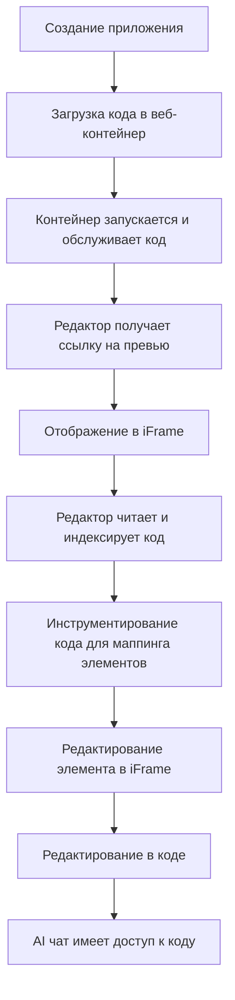

# Архитектура проекта Onlook

## Обзор проекта

**Onlook** — это визуальный редактор кода с открытым исходным кодом для создания веб-сайтов, прототипов и дизайнов с использованием AI. Это альтернатива таким инструментам, как Bolt.new, Lovable, V0, Replit Agent, Figma Make, Webflow и др.

### Основные возможности:
- Создание Next.js приложений за секунды (из текста, изображения или шаблонов)
- Визуальное редактирование приложения с интерфейсом в стиле Figma
- Предпросмотр в реальном времени
- Управление бренд-активами и токенами
- Создание и навигация по страницам
- Управление изображениями проекта
- Использование ветвления (branching) для экспериментов с дизайном
- Разработка с помощью AI чата
- Развертывание приложения за секунды

---

## Технологический стек

### Frontend
- **Next.js** — Full-stack фреймворк
- **TailwindCSS** — Стилизация
- **tRPC** — Серверный интерфейс
- **MobX** — Управление состоянием (mobx-react-lite)
- **next-intl** — Интернационализация

### Backend
- **Supabase** — Auth, Database, Storage
- **Drizzle** — ORM

### AI
- **AI SDK** — LLM клиент
- **OpenRouter** — Провайдер LLM моделей
- **Morph Fast Apply** — Провайдер моделей для быстрого применения
- **Relace** — Провайдер моделей для быстрого применения

### Sandbox и хостинг
- **CodeSandboxSDK** — Песочница для разработки
- **Freestyle** — Хостинг

### Runtime
- **Bun** — Monorepo, runtime, bundler
- **Docker** — Управление контейнерами

---

## Структура монорепозитория

Проект использует **Bun workspaces** для управления монорепозиторием.

### Корневая структура

```
onlook-main 2/
├── apps/              # Приложения
├── packages/          # Общие пакеты
├── tooling/           # Инструменты разработки
├── assets/            # Статические ресурсы
├── docs/              # Документация
└── scripts/           # Скрипты миграции и утилиты
```

---

## Приложения (apps/)

### 1. apps/web/client/ — Основное веб-приложение

Это Next.js приложение с App Router, которое является основным интерфейсом Onlook.

#### Основные директории:

**`app/`** — Next.js App Router страницы и маршруты
- `layout.tsx` — Корневой layout с провайдерами (ThemeProvider, I18nProvider, tRPC)
- `page.tsx` — Главная страница
- `auth/` — Страницы аутентификации
- `login/` — Страница входа
- `invitation/[id]/` — Приглашения пользователей
- `webhook/stripe/` — Stripe вебхуки для подписок

**`components/`** — React компоненты
- `store/` — MobX хранилища состояния
  - `create/` — Хранилище для создания проектов
  - `editor/` — Основное хранилище редактора
    - `engine.ts` — Главный движок редактора
    - `chat/` — AI чат
    - `code/` — Управление кодом
    - `frames/` — Управление фреймами/iFrames
    - `sandbox/` — Управление песочницей
    - `git/` — Git операции
    - `history/` — История изменений
    - `overlay/` — Оверлей для визуального редактирования
    - `style/` — Стили
    - `text/` — Текстовое редактирование
    - `theme/` — Темы
  - `hosting/` — Хранилище для хостинга
  - `state/` — Глобальное состояние
- `ui/` — UI компоненты (модальные окна, настройки и т.д.)

**`server/api/`** — tRPC API маршруты
- `trpc.ts` — Конфигурация tRPC (publicProcedure, protectedProcedure)
- `root.ts` — Агрегация всех роутеров

**`trpc/`** — tRPC клиентская конфигурация
- `react.tsx` — React Query + tRPC провайдер
- `client.ts` — Клиент для браузера
- `server.ts` — Серверный клиент

**`utils/`** — Утилиты
- `supabase/` — Supabase клиенты (server.ts, client/index.ts)

**`hooks/`** — React хуки
- `use-create-blank-project.ts`
- `use-debounce-input.tsx`
- `use-feature-flags.tsx`
- `use-font-loader.tsx`
- `use-get-background.tsx`

**`services/`** — Сервисы
- `sync-engine/` — Движок синхронизации

**`messages/`** — Файлы интернационализации (en, es, ja, ko, zh)

### 2. apps/web/server/ — Серверная часть веб-приложения

Express сервер с tRPC маршрутизацией.

**`src/`**
- `index.ts` — Точка входа сервера
- `router/` — tRPC роутеры
  - `trpc.ts` — Конфигурация tRPC
  - `context.ts` — Контекст tRPC
  - `routes/sandbox.ts` — Маршруты для песочницы

### 3. apps/backend/ — Backend сервис

Backend сервис с Supabase миграциями.

**`supabase/migrations/`** — Миграции базы данных
- `0000_same_human_robot.sql` — Начальная схема
- `0001-0019_*.sql` — Последовательные миграции
- `0006_rls.sql` — Row Level Security
- `0007_realtime_rls.sql` — Realtime RLS
- `0008_preview-img-storage.sql` — Хранилище превью изображений
- и т.д.

### 4. apps/admin/ — Админ-панель

Административный интерфейс.

---

## Пакеты (packages/)

### 1. packages/models/ — Модели данных

Типы и модели для доменной области.

**`src/`**
- `actions/` — Модели действий (action.ts, code.ts, location.ts, target.ts)
- `assets/` — Модели активов
- `create/` — Модели создания
- `domain/` — Доменные модели
- `editor/` — Модели редактора
- `font/` — Модели шрифтов
- `hosting/` — Модели хостинга
- `pages/` — Модели страниц (opengraph.ts)
- `project/` — Модели проекта (branch.ts, canvas.ts, command.ts, frame.ts, project.ts, rect.ts, role.ts, settings.ts)
- `sandbox/` — Модели песочницы (files.ts, folder.ts, template.ts)
- `style/` — Модели стилей
- `supabase/` — Модели Supabase (db.ts)
- `usage/` — Модели использования
- `user/` — Модели пользователя (settings.ts, user.ts)

### 2. packages/parser/ — Парсер кода

Парсинг и манипуляция кодом.

**`src/`**
- `parse.ts` — Основной парсер
- `helpers.ts` — Вспомогательные функции
- `ids.ts` — Генерация ID
- `packages.ts` — Работа с пакетами
- `prettier/` — Форматирование кода
- `template-node/` — Работа с шаблонными узлами
- `code-edit/` — Редактирование кода
  - `group.ts` — Группировка
  - `helpers.ts` — Вспомогательные функции
  - `image.ts` — Изображения
  - `insert.ts` — Вставка
  - `layout.ts` — Макет
  - `move.ts` — Перемещение
  - `next-config.ts` — Next.js конфигурация
  - `remove.ts` — Удаление
  - `style.ts` — Стили
  - `text.ts` — Текст
  - `transform.ts` — Трансформация

### 3. packages/utility/ — Утилиты

Общие утилиты и вспомогательные функции.

**`src/`**
- `assert.ts` — Утверждения
- `autolayout.ts` — Автоматическая верстка
- `clone.ts` — Клонирование
- `color.ts` — Работа с цветами
- `domain.ts` — Работа с доменами
- `email.ts` — Работа с email
- `errors.ts` — Обработка ошибок
- `file.ts` — Работа с файлами
- `folder.ts` — Работа с папками
- `font.ts` — Работа со шрифтами
- `frame.ts` — Работа с фреймами
- `id.ts` — Генерация ID
- `image.ts` — Работа с изображениями
- `initials.ts` — Инициалы
- `math.ts` — Математические операции
- `name.ts` — Работа с именами
- `null.ts` — Проверка на null
- `path.ts` — Работа с путями
- `screenshot.ts` — Скриншоты
- `string.ts` — Работа со строками
- `tailwind.ts` — Tailwind утилиты
- `time.ts` — Работа со временем
- `tw-merge.ts` — Слияние Tailwind классов
- `unit.ts` — Работа с единицами измерения
- `urls.ts` — Работа с URL
- `window-metadata.ts` — Метаданные окна

### 4. packages/git/ — Git операции

**`src/`**
- `git.ts` — Git операции
- `index.ts` — Экспорт

### 5. packages/growth/ — Growth инструменты

**`src/`**
- `helpers.ts` — Вспомогательные функции
- `inject.ts` — Инъекция кода
- `remove.ts` — Удаление кода
- `script.ts` — Скрипты

### 6. packages/code-provider/ — Провайдер кода

Абстракция над различными провайдерами кода (CodeSandbox, NodeFS).

**`src/`**
- `providers.ts` — Провайдеры
- `types.ts` — Типы
- `providers/codesandbox/` — CodeSandbox провайдер
  - `utils/` — Утилиты (list-files, read-file, write-file, utils)
- `providers/nodefs/` — NodeFS провайдер

### 7. packages/fonts/ — Работа со шрифтами

**`src/`**
- `default.ts` — Шрифты по умолчанию
- `family.ts` — Семейства шрифтов
- `utils.ts` — Утилиты
- `variants.ts` — Варианты шрифтов
- `helpers/` — Вспомогательные функции
  - `ast-generators.ts` — Генераторы AST
  - `ast-manipulators.ts` — Манипуляторы AST
  - `class-utils.ts` — Утилиты классов
  - `font-extractors.ts` — Извлечение шрифтов
  - `import-export-manager.ts` — Управление импортом/экспортом
  - `validators.ts` — Валидаторы

### 8. packages/file-system/ — Файловая система

**`src/`**
- `fs.ts` — Файловая система
- `code-fs.ts` — Кодовая файловая система
- `config.ts` — Конфигурация
- `index-cache.ts` — Кэш индекса
- `types.ts` — Типы
- `hooks/` — React хуки (use-dir, use-file, use-fs)

### 9. packages/image-server/ — Сервер изображений

**`src/`**
- `compress.ts` — Сжатие изображений
- `index.ts` — Точка входа
- `types.ts` — Типы

### 10. packages/email/ — Email сервис

**`src/`**
- `client.ts` — Email клиент
- `invitation.ts` — Приглашения
- `templates/` — Шаблоны писем
- `types/send-email.ts` — Типы

### 11. packages/stripe/ — Stripe интеграция

**`src/`**
- `client.ts` — Stripe клиент
- `functions.ts` — Функции
- `constants.ts` — Константы
- `types.ts` — Типы
- `scripts/` — Скрипты (dev, production)

### 12. packages/rpc/ — RPC клиент

**`src/`**
- `trpc/` — tRPC конфигурация
  - `config.ts` — Конфигурация
  - `index.ts` — Экспорт
  - `types.ts` — Типы

### 13. packages/ai/ — AI интеграция

**`src/`**
- `prompt/` — Промпты
  - `provider.ts` — Провайдер промптов
- `tokens/` — Токены

### 14. packages/types/ — Общие типы

Общие типы для всего проекта.

### 15. packages/ui/ — UI компоненты

Переиспользуемые UI компоненты.

### 16. packages/penpal/ — Penpal библиотека

Библиотека для коммуникации между iframe и родительским окном.

**`src/`**
- `parent.ts` — Родительская часть
- `child.ts` — Дочерняя часть

### 17. packages/github/ — GitHub интеграция

Интеграция с GitHub.

### 18. packages/constants/ — Константы

Общие константы проекта.

### 19. packages/db/ — База данных

Конфигурация базы данных.

---

## Архитектура работы Onlook

### Как это работает (High-Level)



### Поток данных

1. **Создание приложения**: Код загружается в веб-контейнер (CodeSandbox)
2. **Запуск**: Контейнер запускается и обслуживает код
3. **Предпросмотр**: Редактор получает ссылку на превью и отображает её в iFrame
4. **Индексация**: Редактор читает и индексирует код из контейнера
5. **Инструментирование**: Код инструментируется для маппинга элементов к их месту в коде
6. **Редактирование**: При редактировании элемента, он редактируется в iFrame, затем в коде
7. **AI чат**: AI чат также имеет доступ к коду и инструменты для понимания и редактирования кода

---

## Ключевые паттерны и архитектурные решения

### 1. MobX для управления состоянием

- Хранилища создаются с `useState(() => new Store())` для стабильности
- Активное хранилище хранится в `useRef`
- Очистка асинхронных операций с `setTimeout(() => storeRef.current?.clear(), 0)`
- Компоненты с `observer` должны быть клиентскими (`use client`)

### 2. tRPC для API

- Роутеры в `apps/web/client/src/server/api/routers/**`
- Экспортируются из `apps/web/client/src/server/api/root.ts`
- Используют `publicProcedure`/`protectedProcedure` из `trpc.ts`
- Валидация входных данных с Zod
- Сериализация через SuperJSON

### 3. Supabase для Auth и Database

- Серверный клиент: `apps/web/client/src/utils/supabase/server.ts`
- Клиент для браузера: `apps/web/client/src/utils/supabase/client/index.ts`
- Никогда не передавать серверный клиент в клиентский код

### 4. Environment Variables

- Определение/валидация в `apps/web/client/src/env.ts` через `@t3-oss/env-nextjs`
- Браузерные переменные с `NEXT_PUBLIC_*`
- В серверных хелперах читать `process.env` только для deployment vars
- Импорт `./src/env` в `next.config.ts` для валидации

### 5. Next.js App Router

- По умолчанию Server Components
- `use client` для событий, state/effects, browser APIs
- Клиентские провайдеры за клиентской границей
- Структура: `apps/web/client/src/app/**` (`page.tsx`, `layout.tsx`, `route.ts`)

### 6. Интернационализация

- `next-intl` настроен
- Провайдер в `apps/web/client/src/app/layout.tsx`
- Строки в `apps/web/client/messages/*`
- Избегать хардкода пользовательского текста

---

## Скрипты и команды

### Основные команды (из корня)

```bash
bun dev              # Запуск dev сервера
bun build            # Сборка
bun start            # Запуск продакшн
bun test             # Запуск тестов
bun typecheck        # Проверка типов
bun lint             # Линтинг
bun format           # Форматирование
```

### База данных

```bash
bun db:push          # Применить изменения к локальной БД
bun db:seed          # Заполнить БД тестовыми данными
bun db:migrate       # Миграции
bun db:reset         # Сброс БД
```

### Docker

```bash
bun docker:build     # Сборка Docker образов
bun docker:up        # Запуск контейнеров
bun docker:down      # Остановка контейнеров
bun docker:logs      # Логи контейнеров
bun docker:restart   # Перезапуск контейнеров
```

---

## Важные файлы конфигурации

- `package.json` — Корневой package.json с workspaces
- `bun.lock` — Lock файл Bun
- `bunfig.toml` — Конфигурация Bun
- `eslint.config.js` — Конфигурация ESLint
- `.gitignore` — Игнорируемые файлы Git
- `docker-compose.yml` — Docker Compose конфигурация
- `Dockerfile` — Docker образ

---

## Правила для агентов (из AGENTS.md)

1. **Минимальные диффы** — Маленькие, корректные изменения
2. **Границы client/server** — Уважать границы в App Router
3. **Локальные паттерны** — Предпочитать существующие абстракции
4. **Не модифицировать** — build outputs, generated files, lockfiles
5. **Использовать Bun** — Для всех установок и скриптов
6. **Не запускать dev server** — В контексте автоматизации
7. **Type safety** — Уважать типобезопасность
8. **Server Components** — По умолчанию
9. **tRPC роутеры** — Экспортировать из `root.ts`
10. **Env vars** — Типизировать в `env.ts`
11. **Импорты** — Использовать path aliases (`@/*`, `~/*`)
12. **MobX stores** — Не использовать `useMemo` для создания
13. **TailwindCSS** — Стилизация через Tailwind
14. **i18n** — Использовать message files
15. **Поиск** — Искать узко с ripgrep
16. **Тесты** — `bun test`
17. **db:push** — Применять изменения к локальной БД
18. **НЕ запускать db:gen** — Зарезервировано для мейнтейнера

---

## Заключение

Onlook — это сложный монорепозиторий с четким разделением ответственности между приложениями и пакетами. Архитектура построена вокруг Next.js App Router, tRPC, Supabase и MobX для управления состоянием. Проект использует Bun для управления зависимостями и выполнения скриптов.

Ключевые особенности:
- Визуальное редактирование с AI
- Монорепозиторий с Bun workspaces
- tRPC для типизированного API
- Supabase для Auth и Database
- MobX для клиентского состояния
- Поддержка интернационализации
- Docker для контейнеризации
